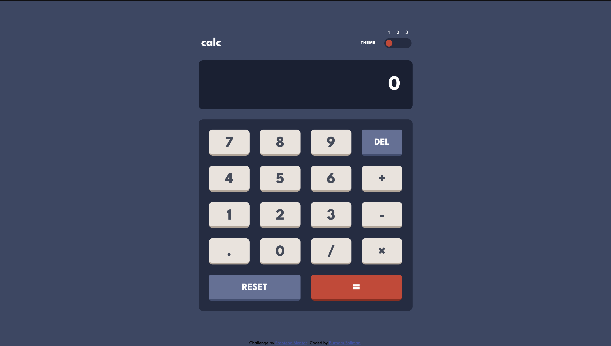
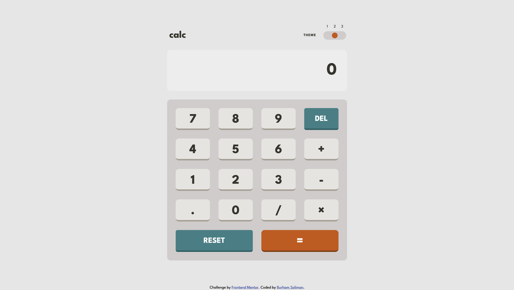
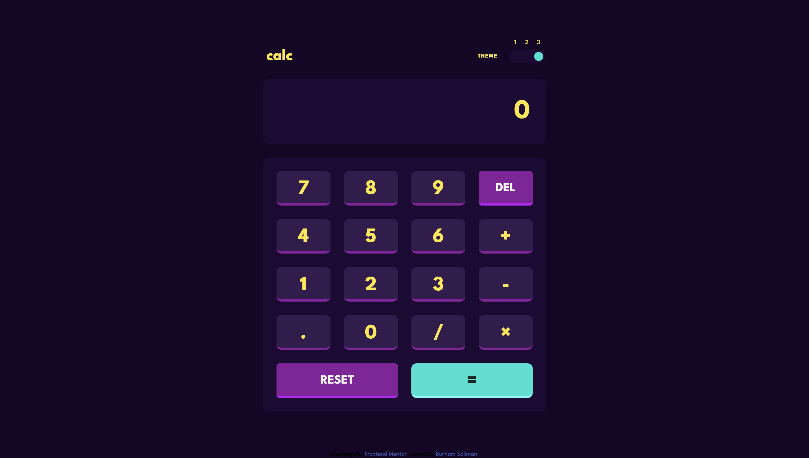
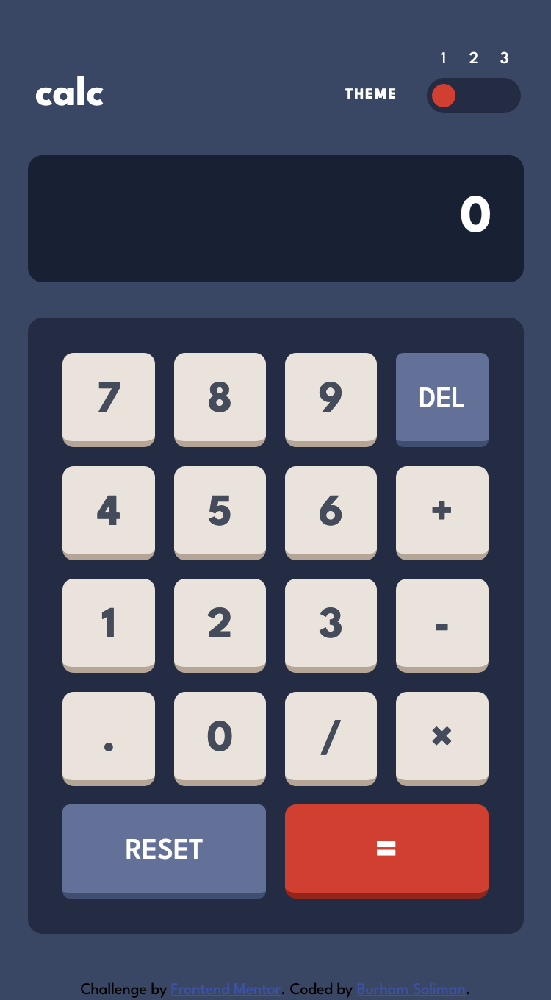
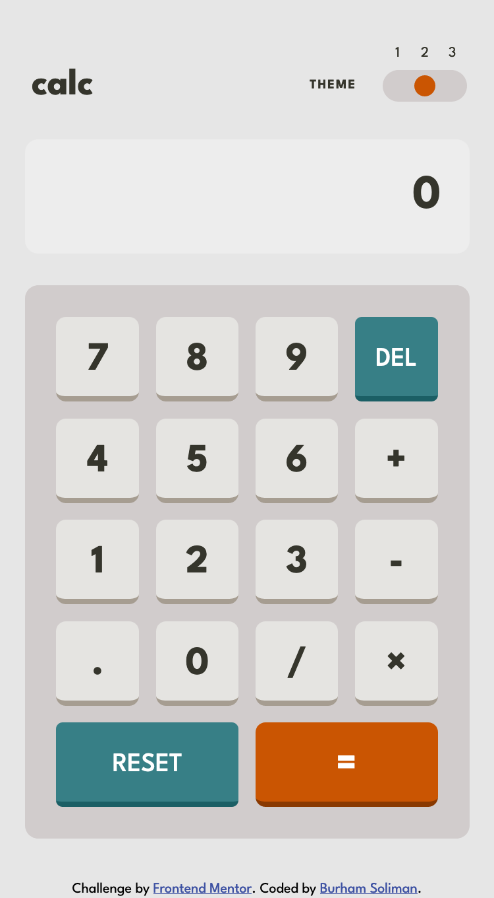
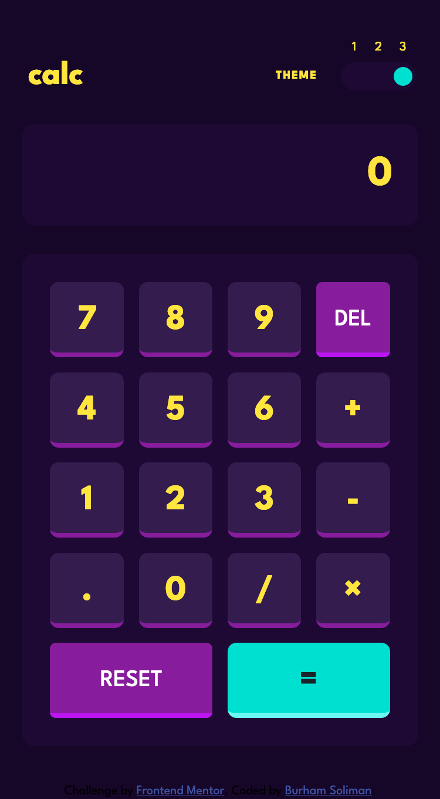

# Frontend Mentor - Calculator app solution

This is a solution to the [Calculator app challenge on Frontend Mentor](https://www.frontendmentor.io/challenges/calculator-app-9lteq5N29). Frontend Mentor challenges help you improve your coding skills by building realistic projects. 

## Table of contents

- [Overview](#overview)
  - [The challenge](#the-challenge)
  - [Screenshot](#screenshot)
  - [Links](#links)
- [My process](#my-process)
  - [Built with](#built-with)
  - [What I learned](#what-i-learned)
  - [Continued development](#continued-development)
  - [Useful resources](#useful-resources)
- [Author](#author)
- [Acknowledgments](#acknowledgments)

## Overview

### The challenge

Users should be able to:

- See the size of the elements adjust based on their device's screen size [ **Done** ]
- Perform mathmatical operations like addition, subtraction, multiplication, and division [ **Done** ]
- Adjust the color theme based on their preference [ **Done** ]
- **Bonus**: Have their initial theme preference checked using `prefers-color-scheme` and have any additional changes saved in the browser [ **Done** ]

### Screenshot

#### Desktop view

#### Mobile view

### Links

- Solution URL: [Repo](https://github.com/egstar/Calc)
- Live Site URL: [Live page](https://egstar.github.io/Calc)

## My process

### Built with

- Semantic HTML5 markup
- CSS custom properties
- Flexbox
- CSS Grid
- CSS Theming
- Mobile-first workflow
- JS Functions (map, some, eval, localStorage)

### What I learned

Nothing new

### Continued development

Nothing to do

### Useful resources

Self build

## Author

- Website - [Burham Soliman](https://www.burhams.com)
- Frontend Mentor - [@egstar](https://www.frontendmentor.io/profile/egstar)
- Twitter - [@bori0o](https://www.twitter.com/bori0o)

## Acknowledgments

Self build, with no assist.
